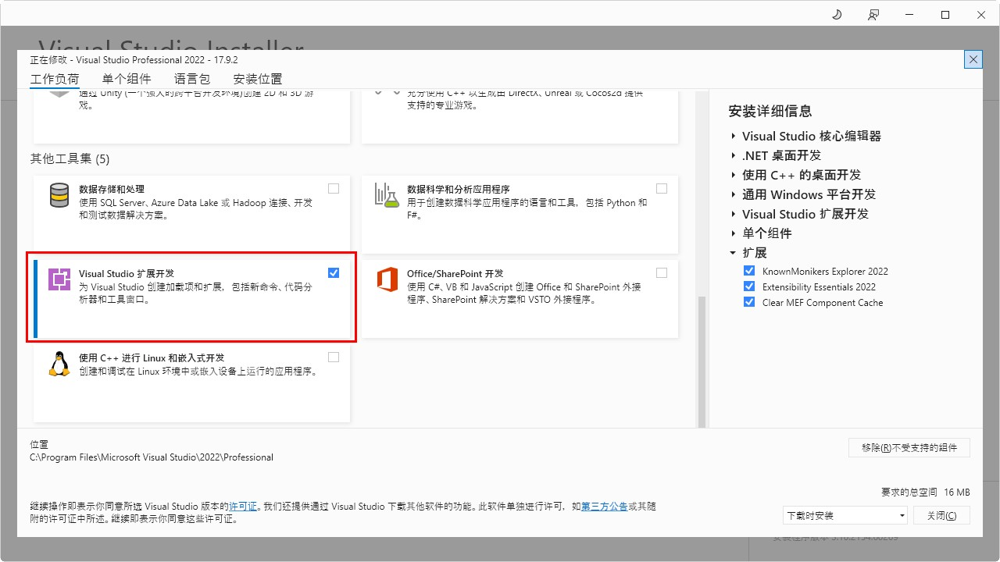

# Visual Studio 扩展开发

  地址：[https://learn.microsoft.com/zh-cn/visualstudio/extensibility/vsix/get-started/get-tools?view=vs-2022]

  文档：

## 开发指南 ##

1. 打开 Visual Studio Installer，安装 "Visual Studio 扩展开发"

   

2. 安装扩展 "Extensibility Essentials 2022"
   
   [扩展(X)]-[管理扩展]-[联机]-[搜索]

3. 确认项目中是否已安装 NuGet 程序包：

   Community.VisualStudio.Toolkit.17, Community.VisualStudio.VSCT, Microsoft.VSSDK.BuildTools

4. 如果单元测试项目编译出错，则另外创建一个解决方案，并使用模板 "单元测试项目(.NET Framework)" 新建项目，然后把其工程目录中的 packages 包拷贝过来